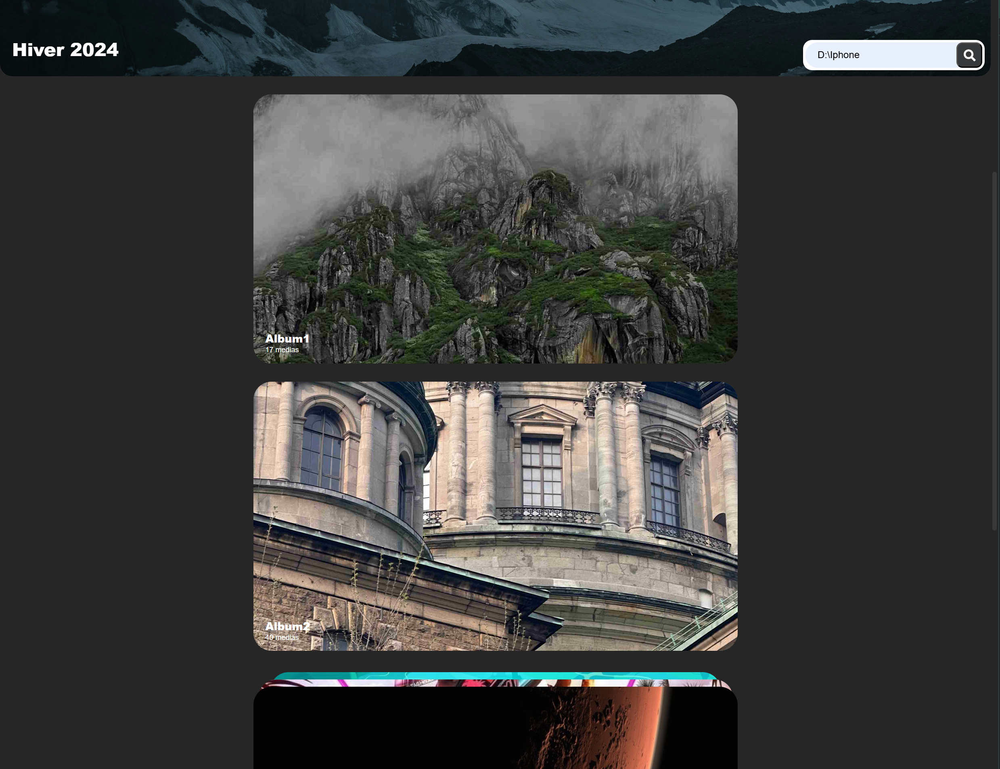
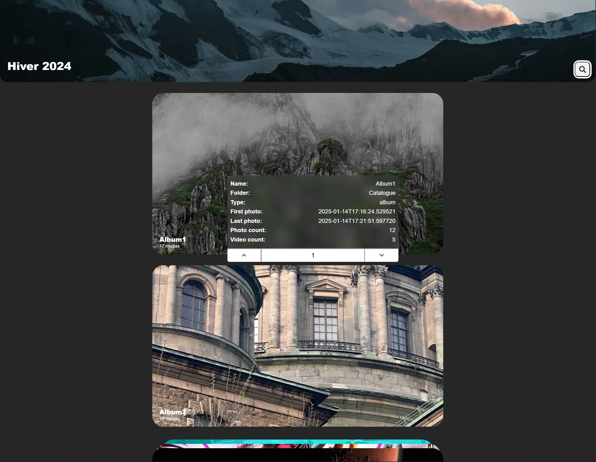
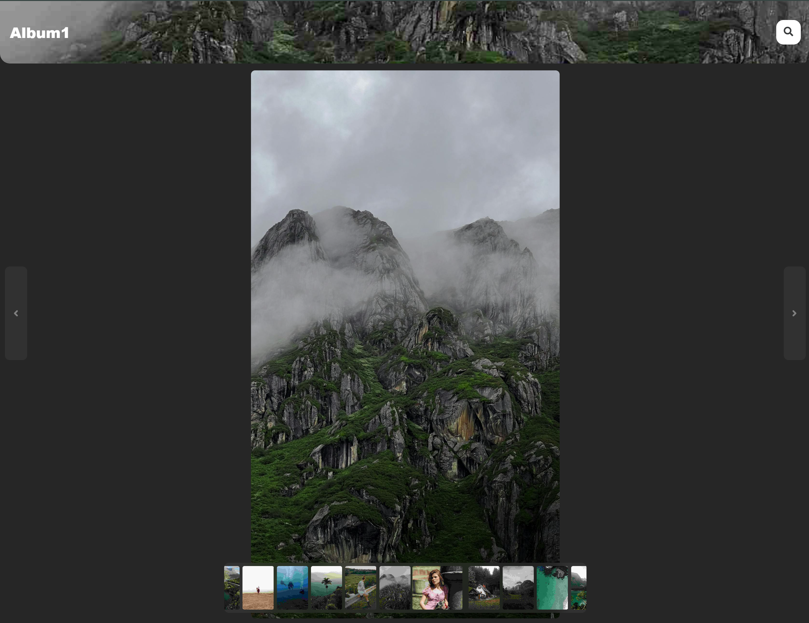
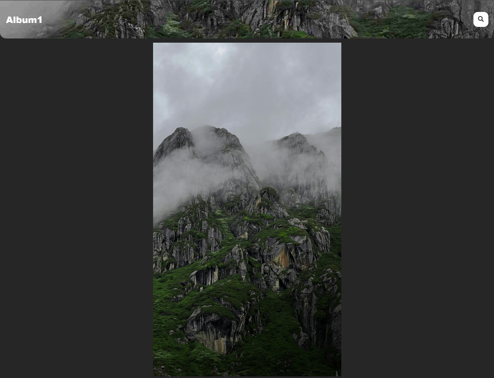

# Gestionnaire d'Album Multimédia 📂🎥📸

Ce projet est une application web conçue pour gérer des albums multimédias (images et vidéos) de manière intuitive et interactive. Il fournit une interface utilisateur riche et des fonctionnalités avancées pour la navigation, le tri et la visualisation de contenus multimédias.

---

## Fonctionnalités 🛠️

### Page d'accueil
- **Affichage des albums et dossiers** avec des vignettes interactives.
- **Statistiques globales** des images et vidéos disponibles.

📷 **Capture d'écran de la page d'accueil :**  
<table>
  <tr>
    <td>
      
      <p><em>Une barre de saisie est située en haut à droite de chaque page de l'application. Dans la démonstration, elle permet de spécifier le chemin de la galerie que l'on souhaite visualiser dans l'application.</em></p>
    </td>
    <td>
      
      <p><em>Un clic droit sur un élément de la <strong>HomePage</strong> fait apparaître une popup. Celle-ci affiche diverses informations liées à l'élément sélectionné et offre la possibilité de modifier son ordre dans la page. Ce changement est sauvegardé et reste effectif même après la fermeture et la réouverture de la page.</em></p>
    </td>
  </tr>
</table>


---

### Page de dossier
- **Regroupement des albums** sous un même dossier.
- Navigation intuitive vers les albums.
- **Statistiques du dossier** (nombre de photos, vidéos, albums).

📷 **Capture d'écran de la page de dossier :**  
<table>
  <tr>
    <td>
      
      <p><em>Un clic droit sur un album de la <strong>FolderPage</strong> ouvre une popup affichant des informations détaillées sur l'album sélectionné, telles que son nom, sa plage de dates et le nombre de médias qu'il contient.</em></p>
    </td>
</table>

---

### Page d'album
- **Affichage des médias** d'un album spécifique (images et vidéos).
- **Tri par date** et filtres pour afficher uniquement les photos ou les vidéos.
- **Navigation fluide** entre les médias grâce à un carrousel interactif.

📷 **Capture d'écran de la page d'album :**  
<table>
  <tr>
    <td>
      
      <p><em>Passer la souris sur une vidéo dans l'<strong>AlbumPage</strong> déclenchera automatiquement sa lecture.</em></p>
    </td>
    <td>
      
      <p><em>Un clic droit sur un média dans l'<strong>AlbumPage</strong> ouvre une popup affichant des informations détaillées sur le média sélectionné. Si le média est une image, la popup offre également la possibilité de la définir comme image de présentation de l'album. Ce changement est sauvegardé et reste effectif même après la fermeture et la réouverture de la page.</em></p>
    </td>
  </tr>
  <tr>
    <td>
      
      <p><em>Le Footer de l'<strong>AlbumPage</strong> regroupe plusieurs fonctionnalités. Le sélecteur permet de choisir entre l'affichage exclusif des photos, des vidéos, ou des deux types de médias combinés (option "Album"). Passer la souris sur le bouton situé à gauche fait apparaître un menu détaillé contenant des informations sur l'album, ainsi que deux boutons permettant de sélectionner le mode de tri des médias.</em></p>
    </td>
  </tr>
</table>


---

### Carrousel multimédia
- **Vue détaillée** des images et vidéos.
- Commandes personnalisées pour les vidéos :
  - Lecture, pause, plein écran, réglage du volume.
- **Défilement fluide** pour explorer les médias.

📷 **Capture d'écran du carrousel multimédia :**  
<table>
  <tr>
    <td>
      
      <p><em>La navigation dans la <strong>BrowserPage</strong> peut se faire de deux manières : en utilisant les boutons situés de part et d'autre de la page, ou en appuyant sur les flèches gauche et droite du clavier.
      Le carrousel situé en bas de la page permet de prévisualiser les médias précédents ou suivants. Il est navigable à l'aide du défilement de la souris. En cliquant sur l'une des prévisualisations, vous êtes automatiquement redirigé vers le média correspondant.</em></p>
    </td>
    <td>
      
      <p><em>Si aucun clic ou mouvement de souris n'est détecté pendant un certain laps de temps, les éléments interactifs sont masqués, permettant au média de s'afficher en plein écran et d'occuper tout l'espace disponible.</em></p>
    </td>
  </tr>
  <tr>
    <td>
      
      <p><em>Le Footer de l'<strong>AlbumPage</strong> regroupe plusieurs fonctionnalités. Le sélecteur permet de choisir entre l'affichage exclusif des photos, des vidéos, ou des deux types de médias combinés (option "Album"). Passer la souris sur le bouton situé à gauche fait apparaître un menu détaillé contenant des informations sur l'album, ainsi que deux boutons permettant de sélectionner le mode de tri des médias.</em></p>
    </td>
  </tr>
</table>


---

## Dépendances Python (pip) 📦

Pour exécuter correctement le backend de ce projet, installez les dépendances suivantes :

```bash
pip install flask
pip install flask-cors
pip install pillow
pip install moviepy
pip install numpy
pip install requests
pip install geopy
pip3 install opencv-python
```

## Dépendances Python (pip) 📦


